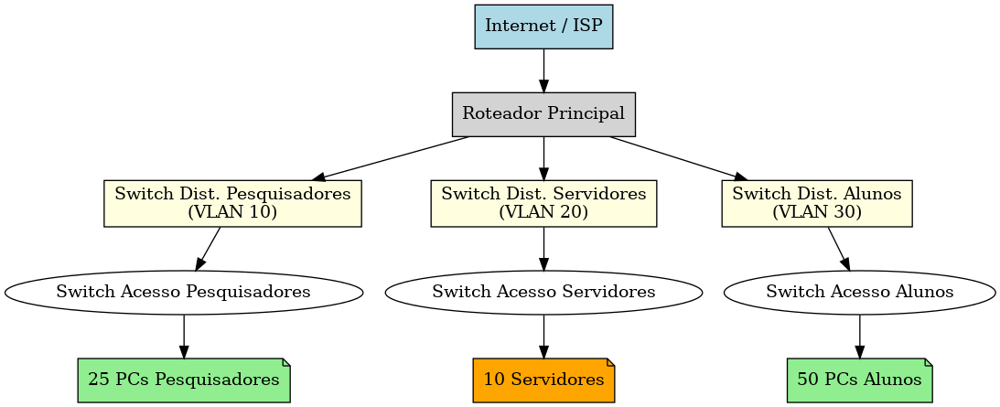

# Projeto de Infraestrutura de Rede IPv4 – Laboratório

## 1. Topologia Física (Cisco Packet Tracer)

A disposição física dos equipamentos segue o modelo hierárquico em camadas, garantindo **escalabilidade**, **segurança** e **facilidade de gerenciamento**.

### Disposição dos Dispositivos

1. **Camada de Núcleo (Core Layer)**
   - **1 Roteador Principal (Edge Router)** conectado ao provedor de internet.
   - Responsável pela conexão externa e pela distribuição do tráfego para as redes internas.

2. **Camada de Distribuição (Distribution Layer)**
   - **3 Switches de Camada 3** (ou switches de camada 2 com roteamento via router-on-a-stick) para segmentar VLANs:
     - Switch Pesquisadores
     - Switch Servidores
     - Switch Alunos/Estagiários

3. **Camada de Acesso (Access Layer)**
   - **Switches de Acesso** conectados a cada grupo de usuários ou racks de servidores.
   - Hosts finais (PCs, notebooks) e servidores conectados diretamente aos switches de acesso.

4. **Servidores Internos** (na VLAN de Servidores)
   - Servidor Web (portal/documentação)
   - Servidor de Arquivos (datasets)
   - Servidor DNS interno

5. **Hosts Finais**
   - 25 PCs para Pesquisadores
   - 50 PCs para Alunos/Estagiários
   - 10 Servidores físicos/virtuais na área de infraestrutura

> **No Cisco Packet Tracer**:
> - Posicionar o roteador no topo (ligado ao ícone “Cloud” para simular o provedor).
> - Conectar os switches de distribuição ao roteador.
> - Conectar os switches de acesso abaixo dos switches de distribuição.
> - Conectar os hosts e servidores aos switches de acesso.

---

## 2. Topologia Lógica

A topologia lógica mostra como as redes estão **segmentadas** e **interligadas**, independentemente da posição física dos equipamentos.

### Segmentação de Rede

- **VLAN 10 – Pesquisadores (192.168.10.0/24)**
  - Acesso irrestrito à internet, isolamento das outras VLANs.
  - Rede utilizada para simulações e análise segura.

- **VLAN 20 – Servidores (192.168.20.0/24)**
  - Alta proteção, acessível apenas de VLANs autorizadas.
  - Hospeda serviços internos como DNS, Web e Arquivos.

- **VLAN 30 – Alunos/Estagiários (192.168.30.0/24)**
  - Acesso à internet e aos serviços públicos do laboratório.
  - Sem acesso direto às redes de Pesquisadores ou Servidores.

### Fluxo de Dados

- **Internet → Roteador → VLAN apropriada**
- **VLAN 10 ↔ Internet** (liberado)
- **VLAN 30 ↔ Internet** (liberado)
- **VLAN 20 ↔ VLAN 10/30** (restrito, apenas para serviços autorizados)

---

## 3. Justificativa Técnica

### Escolha da Topologia
- **Topologia em Camadas (Core–Distribution–Access)**:
  - Melhora a **escalabilidade**, **manutenção** e **resiliência**.
  - Facilita futuras expansões, como adição de novas VLANs ou grupos de usuários.
  
- **Segmentação por VLANs**:
  - Isola o tráfego entre grupos.
  - Aumenta a segurança e facilita a aplicação de políticas de rede.

- **Roteador Central + Switches de Camada 3**:
  - Permite roteamento inter-VLAN de forma eficiente e controlada.
  - ACLs aplicadas para filtrar tráfego indesejado.

### Função dos Equipamentos

- **Roteador Principal (Edge Router)**:
  - Conecta a rede interna ao ISP.
  - Aplica NAT e políticas de segurança para tráfego de entrada e saída.

- **Switches de Camada 3 (Distribution)**:
  - Fazem o roteamento entre VLANs.
  - Aplicam ACLs e controlam o fluxo de dados entre segmentos.

- **Switches de Acesso**:
  - Conectam dispositivos finais às VLANs corretas.
  - Garantem a segmentação de tráfego no nível físico.

- **Servidores**:
  - Mantidos na VLAN 20 para maior segurança.
  - Fornecem serviços essenciais ao laboratório.

